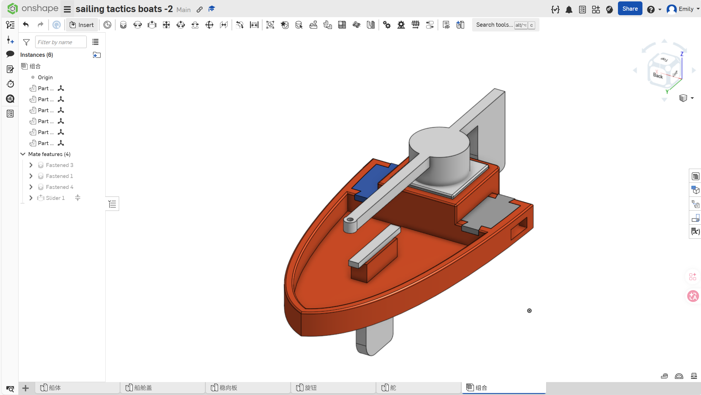
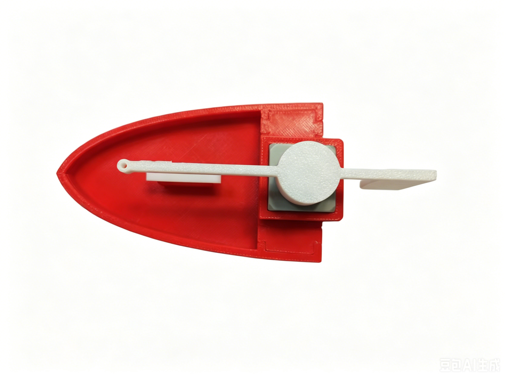
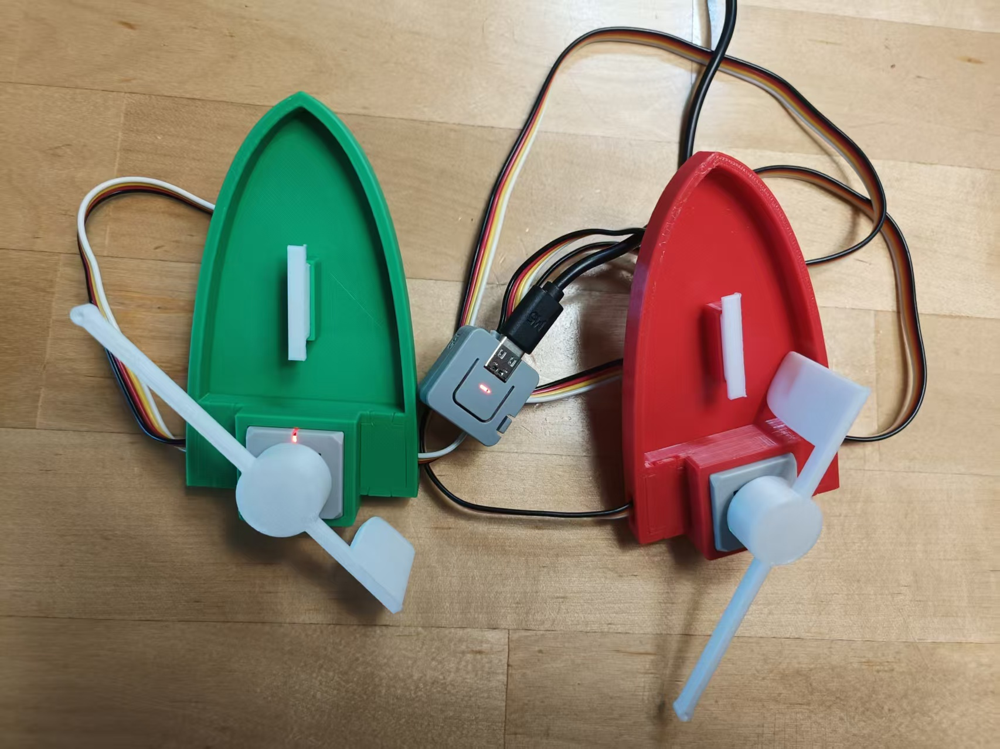
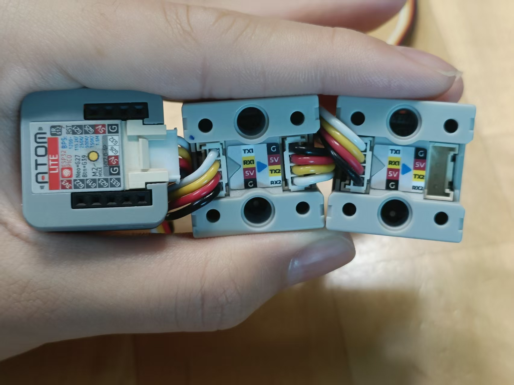
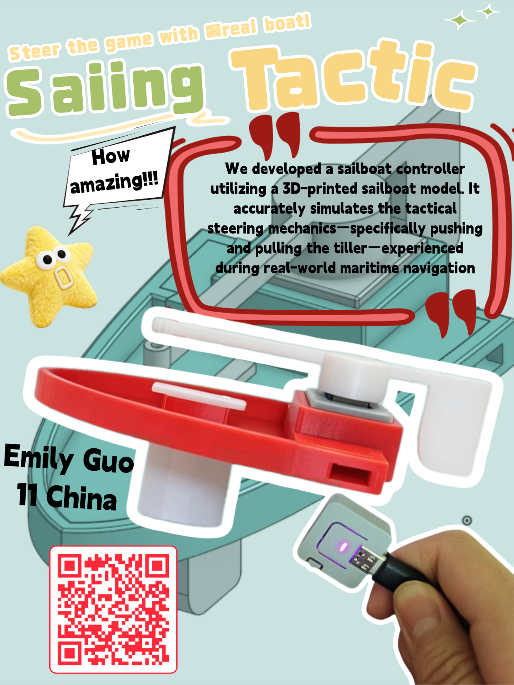

## What is this project?

This project is a sailing boat controller. It uses a 3D printed boat model to simulate the rudder movement of a real sailing boat. The controller uses an M5Stack Atom as the main controller. Its built-in LED shows different states, such as Bluetooth connection, game mode, and calibration mode. Each M5Stack Chain Angle sensor is mounted inside a 3D printed boat shell.

  

The M5Stack Chain Angle sensors work as the boat rudders. They read the rudder angle and convert the movement into keyboard inputs for Tactical Sailing.

    

The M5Stack Chain Angle modules connect through the HY2.0-4P chain interface, so I do not need to wire each GPIO pin manually. The Atom Basic connects to the first Chain Angle module, then the OUT port of the first Chain Angle connects to the IN port of the second Chain Angle. The close-up photo shows the G / 5V / TX / RX labels next to the connector.

## How to use it

### 1. LED states

- Solid red: game mode is on and the controller is sending keyboard inputs
- Blinking yellow: Bluetooth is not connected / waiting for connection
- Blinking purple: angle zeroing / calibration mode
- Short cyan flash: calibration saved and exited successfully
- Blue: status indicator right after Bluetooth connects
- Teal: Bluetooth is connected, but game mode is off
- Short white flash: preparing to clear Bluetooth pairing and restart

### 2. Button controls

- Short press: turn game mode on or off
- Hold for 5 seconds: enter angle zeroing / calibration mode
- Double click during calibration mode: save the current angle as the center point and exit calibration
- Hold for 10 seconds: clear Bluetooth pairing and restart for re-pairing

### 3. Angle feedback

- The closer the knob is to the center, the brighter the light is
- The farther it moves away from the center, the dimmer the light is
- Brightness always stays at at least 20%

## What does it do?

- It can simulate boats in Tactical Sailing
- It lets players control the boat on screen using a physical rudder/knob
- It has game mode, calibration mode, and Bluetooth connection status
- It can calibrate the center position of the boat rudder
- It can connect two boat controllers, so two people can play the sailing game on one computer at the same time

## Design files and BOM

- Bill of Materials: [BOM.csv](BOM.csv)
- CAD source file: [shared Onshape design](https://cad.onshape.com/documents/45688ab7d551252db4da506c/w/4661672f9ede1a1bb0420ff5/e/e09c4bf824f8c0160060557d?renderMode=0&uiState=6a2e347e7fbd1312f954f26b)
- STEP file: [cad/AllBoat.step](cad/AllBoat.step)
- Firmware source code: [src/main_tactical_sailing.cpp](src/main_tactical_sailing.cpp)

## Why did I make it?

I often work as a sailing race judge in Hong Kong on weekends, so I am around sailing a lot. That gave me the idea to build a physical sailing controller that could help sailing clubs introduce the sport to new people. A club could put a large screen near its entrance, set up a few chairs, and let children or visitors control the boats in a computer sailing game using these small physical boat controllers.

This makes sailing easier to understand and more fun to try. It can also be useful on rainy days, when sailing club members cannot go out on the water but still want to practice sailing rules and basic control ideas. I think it can be a fun and useful teaching tool for sailing.

<video src="assets/demo.mp4" controls style="width: 200px; max-width: 50%;"></video>

[Demo video](assets/demo.mp4)
