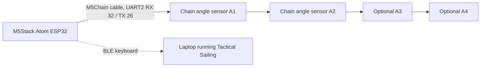

# SailingController

SailingController is a handheld wireless controller for a sailing game. It uses an M5Stack Atom as the ESP32 brain and M5Stack Chain angle sensors as physical boat controls. Each angle sensor acts like a small tiller or dial: turning it sends keyboard inputs over Bluetooth Low Energy, so the controller can steer boats in Tactical Sailing without a USB cable.

The current firmware target is `src/main_tactical_sailing.cpp`. It is built with PlatformIO for the `m5stack-atom` board.

## Why I Made It

Tactical Sailing is more fun when the controls feel like small physical boat controls instead of normal keyboard keys. I wanted a compact controller where each player can turn a real angle sensor and see feedback on the sensor LEDs. The goal is to make a small, portable, easy-to-pair controller that can sit next to a laptop and turn a digital sailing game into something more tactile.

## What It Does

- Reads up to four M5Stack Chain angle sensors.
- Uses the first two sensors for Tactical Sailing keyboard control.
- Sends Bluetooth keyboard input from the ESP32, so no cable is needed while playing.
- Supports a calibration mode to save each sensor's center position.
- Shows connection, game, and calibration states with the Atom LED.
- Sets each angle sensor LED to a different color so the physical controls are easy to tell apart.

## Control Mapping

| Sensor | Intended boat | Left turn key | Right turn key | LED color |
| --- | --- | --- | --- | --- |
| A1 | Boat 1 | Right arrow | Left arrow | Red |
| A2 | Boat 2 | X | V | Green |
| A3 | Reserved | Not mapped yet | Not mapped yet | Yellow |
| A4 | Reserved | Not mapped yet | Not mapped yet | Blue |

The firmware only sends keys while game mode is on. Turning a sensor farther from center repeats keys faster. A deadzone around the center prevents accidental inputs.

## Hardware

| Part | Purpose |
| --- | --- |
| M5Stack Atom | ESP32 controller, BLE keyboard, status LED, and button input |
| M5Stack Chain angle sensors | Physical rotary controls for boats |
| M5Stack Chain cable | Connects the Atom to the chain sensor bus |
| USB-C cable | Power, flashing, and serial monitor |
| Computer with Bluetooth | Receives the controller as a BLE keyboard |

For Fallout submission, the detailed bill of materials should be kept in a CSV file with links and a total cost.

## Wiring Diagram

This project uses the M5Stack Chain connector instead of a custom PCB. The firmware configures the Chain bus on UART2:

| Signal | M5Stack Atom pin |
| --- | --- |
| Chain RX | GPIO 32 |
| Chain TX | GPIO 26 |
| Atom button | GPIO 39 |
| Atom NeoPixel | GPIO 27 |



## How To Build And Upload

1. Install Visual Studio Code.
2. Install the PlatformIO extension.
3. Clone this repository.
4. Connect the M5Stack Atom over USB-C.
5. Build and upload the firmware:

```sh
pio run -e m5stack-atom -t upload
```

6. Open the serial monitor if you want to see sensor discovery and diagnostics:

```sh
pio device monitor -b 115200
```

PlatformIO installs the required libraries from `platformio.ini`:

- `Adafruit NeoPixel`
- `M5Chain`
- `ESP32 BLE Keyboard`

## How To Use It

1. Plug the M5Stack Atom into power.
2. Connect one or more Chain angle sensors to the Chain connector.
3. On the computer, open Bluetooth settings and pair with `Tactical Sailing Boats`.
4. Start Tactical Sailing.
5. Single-click the Atom button to toggle game mode on.
6. Turn sensor A1 or A2 to send the mapped steering keys.
7. Single-click the Atom button again to leave game mode.

## Calibration And Pairing Controls

| Action | Result |
| --- | --- |
| Single click | Toggle game mode on or off |
| Hold for 5 seconds | Enter angle calibration mode |
| Double click while in calibration mode | Save the current sensor angles as center positions |
| Hold for 10 seconds | Clear saved Bluetooth bonds and restart |

Calibration data is saved in ESP32 non-volatile preferences, so the center positions remain after power cycling.

## LED Status

| LED behavior | Meaning |
| --- | --- |
| Orange blink on Atom | Waiting for BLE connection |
| Blue/cyan on Atom | BLE connected recently |
| Green on Atom | BLE connected and idle |
| Red on Atom | Game mode is active |
| Purple blink on Atom | Calibration mode |
| Sensor LEDs dim/brighten | Shows each sensor's distance from its calibrated center |

## Repository Structure

| Path | Description |
| --- | --- |
| `platformio.ini` | PlatformIO board, library, and build configuration |
| `src/main_tactical_sailing.cpp` | Active firmware for Tactical Sailing BLE keyboard control |
| `src/main_backup.cpp` | Earlier BLE gamepad version of the firmware |
| `src/main.cpp` | Earlier single-sensor LED experiment |
| `scripts/patch_ble_gamepad.py` | Helper script from the earlier gamepad experiment |
| `include/`, `lib/`, `test/` | Standard PlatformIO project folders |

## Design Submission Notes

This repository currently contains the firmware source code for the controller. To make the full Fallout design submission complete, the repository should also include:

- A BOM CSV with purchase links and total cost.
- Photos or screenshots of the fully assembled controller.
- A clear final wiring image or assembly diagram.
- CAD files or a buildable mounting design if the controller gets a custom case.
- The Fallout zine page as a PDF.

## License

This project is licensed uthe MIT License. See `LICENSE` for details.


89696969


你的项目是什么
我们做的项目是一个帆船控制器，他用一个3D打印的帆船模型，完全模拟了帆船在海上航行时的推舵拉舵。我们的帆船控制器用了M5Stack Atom 作为主控，上面的LED等可以显示不同的状态，如：蓝牙连接、开始游戏、开始校正等，每个M5Stack ChainAngle Sensor 都套了一个3D打印的帆船壳子，M5Stack ChainAngle Sensor则作为船舵，读取数据，转换成电脑按键操控Tactical Sailing。


如何使用
1.LED
红灯常亮：游戏模式开启，会根据旋钮发送按键
红灯闪烁：蓝牙未连接 / 等待连接
绿灯闪烁：角度归零/校准模式
绿灯短亮：退出校准成功
蓝灯：刚启动或刚连接后的状态提示
暗绿灯：蓝牙已连接但未进入游戏模式，可以将页面转换成Tactial Sailing。
 2.按键
短按：开启/关闭游戏模式
长按 5 秒：进入角度归零/校准模式
校准模式中双击：保存当前角度为中心点，并退出校准
长按 10 秒：清除蓝牙配对并重启，重新配对
3.提示
旋钮越接近中心越亮
偏离越大越暗
最低保持 20% 亮度


它做什么
——他可以模拟Tactical Sailing中的小船
——他可以通过实体的旋钮操纵屏幕中的小船
——他有游戏模式、校准模式，蓝牙连接模式
——他可以校准小船的中心位置
——他可以连接2条小船，让两人同时在电脑上玩帆船游戏

它为什么存在
我平时会周末去香港当帆船裁判，所以经常会接触帆船相关的事物，就想到可以做这样一款帆船控制起来帮助那些帆船俱乐部的人招生，在俱乐部的门口摆一个大屏幕，放着一些椅子，那些路过的小朋友就可以坐在那里，用小船的遥控器来操控电脑上的船，让它左右方向移动。这样还可以稍微了解一下帆船是怎么行驶的，对帆船更感兴趣。而且，当帆船俱乐部的人在下雨天时，就可以靠这个来练习帆船，学习规则，是一款非常好的教学学具！


What your project is
你的项目是什么
What it does  它做什么
Why it exists  它为什么存在
If they have to open even a single file, your README is not doing its job. At minimum, your README.md file must include:
如果他们必须打开单个文件，你的 README 文件就没有做好本职工作。至少，你的 README.md 文件必须包含：

1. Explanation of what your project is
1. 解释你的项目是什么

Short description of what your project is! Highlight what makes it unique
   简要描述你的项目是什么！突出它的独特之处
How do you use it? Be detailed! Others can’t read your mind.
    
Why did you make it? Be personal! Are you solving a problem? Trying to make something smaller than previously thought possible?
   你为什么要做这个？要个性！你在解决一个问题吗？试图创造比之前认为可能更小的事物吗？
2. Add images! A picture is worth a thousand words. Include:
2. 添加图片！一图胜千言。包括：

✓ Screenshots of a full 3D model of your project fully assembled
  你项目完整组装好的 3D 模型截图
✓ Screenshots of your PCB with components, if you have one
  如果你有 PCB，请提供带有元件的 PCB 截图
✓ A clear wiring diagram, if you’re not using a PCB
  如果你不用 PCB，需要一张清晰的接线图
✓ Anything else that makes it clear what your project is and what it’s for
✓ 任何其他能清晰表明你的项目是什么以及它的用途的内容