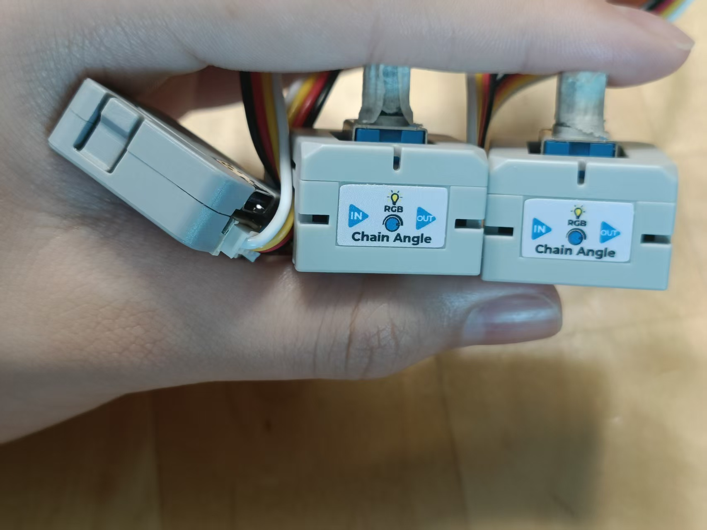

## 你的项目是什么
我们做的项目是一个帆船控制器，他用一个3D打印的帆船模型，完全模拟了帆船在海上航行时的推舵拉舵。我们的帆船控制器用了M5Stack Atom 作为主控，上面的LED等可以显示不同的状态，如：蓝牙连接、开始游戏、开始校正等，每个M5Stack ChainAngle Sensor 都套了一个3D打印的帆船壳子

    

M5Stack ChainAngle Sensor则作为船舵，读取数据，转换成电脑按键操控Tactical Sailing。

   

## 如何使用
### 1. LED 
- 红色常亮：游戏模式开启，会发送按键
- 黄色闪烁：蓝牙未连接 / 等待连接
- 紫色闪烁：角度归零/校准模式
- 青色短亮：退出校准成功
- 蓝色：刚连接蓝牙后的提示状态
- 青绿色：蓝牙已连接，但游戏模式关闭
- 白色短亮：准备清除配对并重启
 ### 2. 按键
- 短按：开启/关闭游戏模式
- 长按 5 秒：进入角度归零/校准模式
- 校准模式中双击：保存当前角度为中心点，并退出校准
- 长按 10 秒：清除蓝牙配对并重启，重新配对
### 3. 提示
- 旋钮越接近中心越亮
- 偏离越大越暗
- 最低保持 20% 亮度

## 它做什么
- 他可以模拟Tactical Sailing中的小船
- 他可以通过实体的旋钮操纵屏幕中的小船
- 他有游戏模式、校准模式，蓝牙连接模式
- 他可以校准小船的中心位置
- 他可以连接2条小船，让两人同时在电脑上玩帆船游戏

## 它为什么存在
我平时会周末去香港当帆船裁判，所以经常会接触帆船相关的事物，就想到可以做这样一款帆船控制起来帮助那些帆船俱乐部的人招生，在俱乐部的门口摆一个大屏幕，放着一些椅子，那些路过的小朋友就可以坐在那里，用小船的遥控器来操控电脑上的船，让它左右方向移动。这样还可以稍微了解一下帆船是怎么行驶的，对帆船更感兴趣。而且，当帆船俱乐部的人在下雨天时，就可以靠这个来练习帆船，学习规则，是一款非常好的教学学具！  
<video src="1772442291.mp4" controls style="width: 200px; max-width: 50%;"></video>  