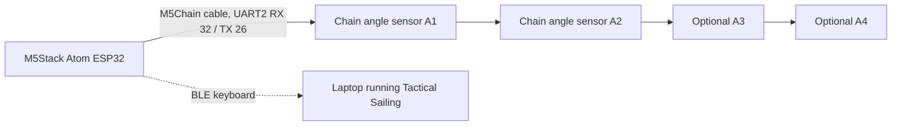

# SailingController

SailingController is a handheld wireless controller for a sailing game. It uses an M5Stack Atom as the ESP32 brain and M5Stack Chain angle sensors as physical boat controls. Each angle sensor acts like a small tiller or dial: turning it sends keyboard inputs over Bluetooth Low Energy, so the controller can steer boats in Tactical Sailing without a USB cable.

The current firmware target is `src/main_tactical_sailing.cpp`. It is built with PlatformIO for the `m5stack-atom` board.

## Why I Made It

Tactical Sailing is more fun when the controls feel like small physical boat controls instead of normal keyboard keys. I wanted a compact controller where each player can turn a real angle sensor and see feedback on the sensor LEDs. The goal is to make a small, portable, easy-to-pair controller that can sit next to a laptop and turn a digital sailing game into something more tactile.

## What It Does

- Reads up to four M5Stack Chain angle sensors.
- Uses the first two sensors for Tactical Sailing keyboard control.
- Sends Bluetooth keyboard input from the ESP32, so no cable is needed while playing.
- Supports a calibration mode to save each sensor's center position.
- Shows connection, game, and calibration states with the Atom LED.
- Sets each angle sensor LED to a different color so the physical controls are easy to tell apart.

## Control Mapping

| Sensor | Intended boat | Left turn key | Right turn key | LED color |
| --- | --- | --- | --- | --- |
| A1 | Boat 1 | Right arrow | Left arrow | Red |
| A2 | Boat 2 | X | V | Green |
| A3 | Reserved | Not mapped yet | Not mapped yet | Yellow |
| A4 | Reserved | Not mapped yet | Not mapped yet | Blue |

The firmware only sends keys while game mode is on. Turning a sensor farther from center repeats keys faster. A deadzone around the center prevents accidental inputs.

## Hardware

| Part | Purpose |
| --- | --- |
| M5Stack Atom | ESP32 controller, BLE keyboard, status LED, and button input |
| M5Stack Chain angle sensors | Physical rotary controls for boats |
| M5Stack Chain cable | Connects the Atom to the chain sensor bus |
| USB-C cable | Power, flashing, and serial monitor |
| Computer with Bluetooth | Receives the controller as a BLE keyboard |

For Fallout submission, the detailed bill of materials should be kept in a CSV file with links and a total cost.

## Wiring Diagram

This project uses the M5Stack Chain connector instead of a custom PCB. The firmware configures the Chain bus on UART2:

| Signal | M5Stack Atom pin |
| --- | --- |
| Chain RX | GPIO 32 |
| Chain TX | GPIO 26 |
| Atom button | GPIO 39 |
| Atom NeoPixel | GPIO 27 |



## How To Build And Upload

1. Install Visual Studio Code.
2. Install the PlatformIO extension.
3. Clone this repository.
4. Connect the M5Stack Atom over USB-C.
5. Build and upload the firmware:

```sh
pio run -e m5stack-atom -t upload
```

6. Open the serial monitor if you want to see sensor discovery and diagnostics:

```sh
pio device monitor -b 115200
```

PlatformIO installs the required libraries from `platformio.ini`:

- `Adafruit NeoPixel`
- `M5Chain`
- `ESP32 BLE Keyboard`

## How To Use It

1. Plug the M5Stack Atom into power.
2. Connect one or more Chain angle sensors to the Chain connector.
3. On the computer, open Bluetooth settings and pair with `Tactical Sailing Boats`.
4. Start Tactical Sailing.
5. Single-click the Atom button to toggle game mode on.
6. Turn sensor A1 or A2 to send the mapped steering keys.
7. Single-click the Atom button again to leave game mode.

## Calibration And Pairing Controls

| Action | Result |
| --- | --- |
| Single click | Toggle game mode on or off |
| Hold for 5 seconds | Enter angle calibration mode |
| Double click while in calibration mode | Save the current sensor angles as center positions |
| Hold for 10 seconds | Clear saved Bluetooth bonds and restart |

Calibration data is saved in ESP32 non-volatile preferences, so the center positions remain after power cycling.

## LED Status

| LED behavior | Meaning |
| --- | --- |
| Orange blink on Atom | Waiting for BLE connection |
| Blue/cyan on Atom | BLE connected recently |
| Green on Atom | BLE connected and idle |
| Red on Atom | Game mode is active |
| Purple blink on Atom | Calibration mode |
| Sensor LEDs dim/brighten | Shows each sensor's distance from its calibrated center |

## Repository Structure

| Path | Description |
| --- | --- |
| `platformio.ini` | PlatformIO board, library, and build configuration |
| `src/main_tactical_sailing.cpp` | Active firmware for Tactical Sailing BLE keyboard control |
| `src/main_backup.cpp` | Earlier BLE gamepad version of the firmware |
| `src/main.cpp` | Earlier single-sensor LED experiment |
| `scripts/patch_ble_gamepad.py` | Helper script from the earlier gamepad experiment |
| `include/`, `lib/`, `test/` | Standard PlatformIO project folders |

## Design Submission Notes

This repository currently contains the firmware source code for the controller. To make the full Fallout design submission complete, the repository should also include:

- A BOM CSV with purchase links and total cost.
- Photos or screenshots of the fully assembled controller.
- A clear final wiring image or assembly diagram.
- CAD files or a buildable mounting design if the controller gets a custom case.
- The Fallout zine page as a PDF.

## License

This project is licensed under the MIT License. See `LICENSE` for details.
